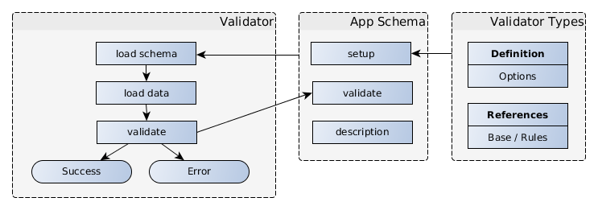
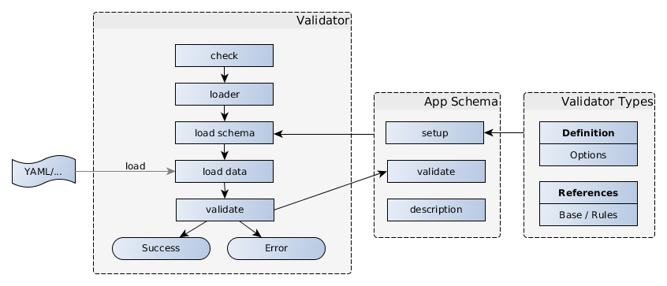
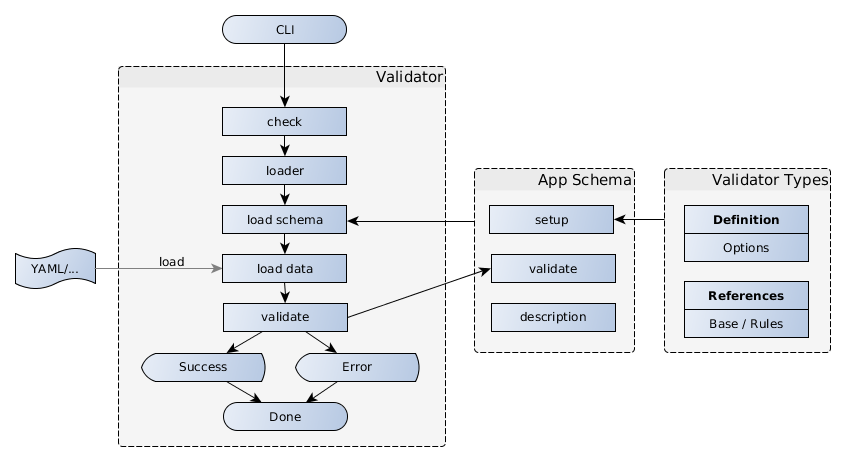
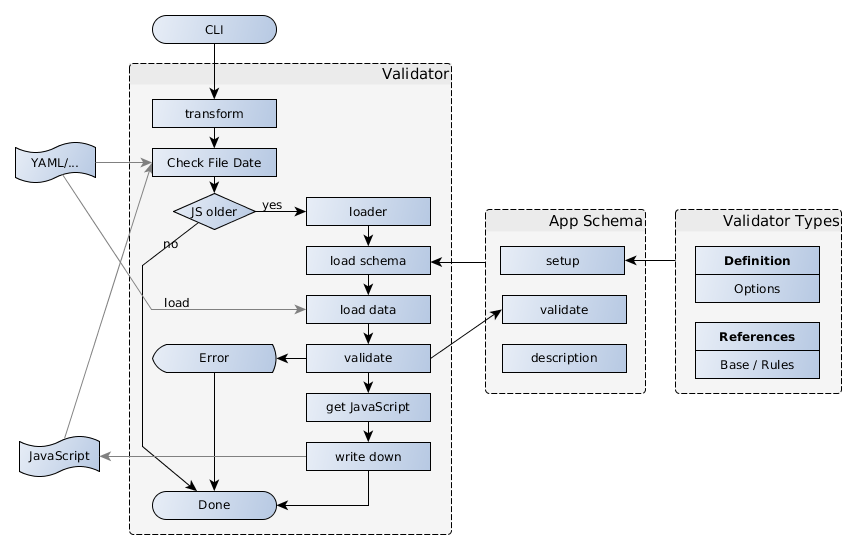

# Architecture

The Validator is based on classes which helps you to easily define a specific data
schema (Schema Builder) and the main class with data loading features. Also a CLI is present
to be used.#

## Schema

The Schema defines what structure is allowed, the allowed values and types of each part
and also how to sanitize the given values. Also the Schema may contain References to other values
inside or outside of the structure. This references may be used as values or as parameters within
the Schema definition. That makes it possible to define the allowed value for one part in dependency
of another element like "must be larger than the other".

Therefore the appropriate class is used to create an instance and set it up
using it´s methods. This newly created schema may also be a structure and combination
of different schema class instances.

- it is easy to set up
- has readable code
- will also check the schema definition
- parts can be linked and cloned
- references are a core element fully supported

Find all information about the [Schema Builder](schema/README.md) classes in the next chapter.

This schema can describe itself human readable and can be given a data structure
to validate. It will run asynchronously over the data structure to check and optimize
it. As a result it will return an promise with the resulting data structure.

If the data isn´t valid it will reject with an Error object which can show the
real problem in detail.

## Validation

Generally it can be used in different ways in your application. In all of them it is best practice
to define your schema in a separate file. That's also needed to use the CLI methods.

### Validate internal data

Within your code you may use the validator to check and optimize data which comes from untrusted
sources:
- file or database
- user input / form data
- arguments or query parameters
- and everything you not already have checked

Here you load the schema and data into your application and let the validation run to get a
reliable structure or error message back. This can be further used.

### Load data from file

If you want to validate some configuration files the validator may also
- search for files in global, user and local directory
- in case of directories combine all files
- combine together if multiple files found
- and at last validate and sanitize them

As extension to the simple validation you give a file search pattern. The validation itself is the
same.

### Only validate file by CLI

If you use config files you may call the validator CLI method to check your configuration changes.

This process is the same as the loading API for configuration files. Only this makes it possible to
directly use the validator to check the files before the application is reloaded.

### Transform file by CLI

Thats an optimization for configuration files which will give your application simplicity and
performance without loosing the validator possibilities.

The validator will read the changed configurations like in the methods before and will create a
javascript file exporting the resulting structure. Your application only needs to import this file
and will get a proofed structure back.

Because it is a JavaScript file it also may include some dynamic parts depending on your structure.
But if you want to keep this files up to date also with changes in external references which you
don't control, you may recreate this maybe each day and reload or restart your app.

## File Loading

The file loading will work with __multiple files__ and also allows to find and combine files from
different locations. Therefore the app will register their name in the validator and it will look
for configuration files in the following order:
- in the __current working directory__ (should be the applications home)
- maybe some more directories if specifically added by your app
- in the __global configuration__ like `/etc/myApp`
- in the __user configuration__ (under the users home folder: `.myApp`)

All found files in any of this locations matching the glob or given path will be loaded and combined
in the above given order. Tha last will have precedence over the previous destinations.
