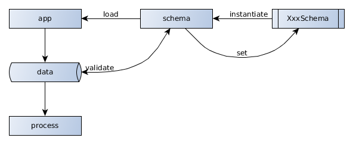

# Architecture

The Validator is based on classes which helps you to easily define a specific data
schema. Therefore the appropriate class is used to create an instance and set it up
using it´s methods. This newly created schema may also be a structure and combination
of different schema class instances.

- it is easy to set up
- has readable code
- will also check the schema definition
- parts can be linked and cloned
- references are a core element fully supported

This schema can describe itself human readable and can be given a data structure
to validate. It will run asynchronously over the data structure to check and optimize
it. As a result it will return an promise with the resulting data structure.

If the data isn´t valid it will reject with an Error object which can show the
real problem in detail.

## Schema

This is the core of this module and defines the concrete checks see more about the possibilities
in the following part.

The app contains a specific schema as an instance of any Schema class which is set to the data
structures specifics. After loading this schema instance and the data structure it may be validated
which process the correctness and optimizes the values like specified in the schema. The resulting data structure can be trusted and used without further checking.

If an error occurs it will contain the original value and a detailed description beside the error message itself.
Mainly you only need the `text` property which will present a markdown formatted
long text explaining what the problem is and how to correctly define the data structure.

## CLI
