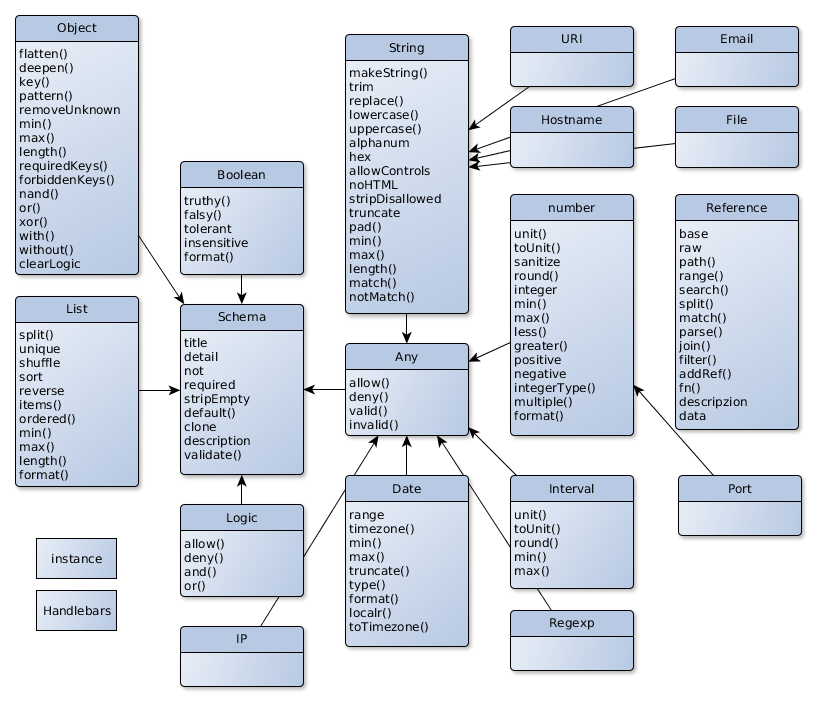

# Architecture

The Validator is based on classes which helps you to easily define a specific data
schema. Therefore the appropriate class is used to create an instance and set it up
using it´s methods. This newly created schema may also be a structure and combination
of different schema class instances.

This schema can describe itself human readable and can be given a data structure
to validate. It will run asynchronously over the data structure to check and optimize
it. As a result it will return an promise with the resulting data structure.

If the data isn´t valid it will reject with an Error object which can show the
real problem in detail.

## Schema

The core of this module are the schema classes which all are subclasses of `Schema`.

Each of this classes have different properties and settings which you can use to
specify it.

The error object which is returned after the validation failed contains all information
necessary:

Mainly you only need the `text` property which will present a markdown formatted
long text explaining what the problem is and how to correctly define the data structure.

## CLI
