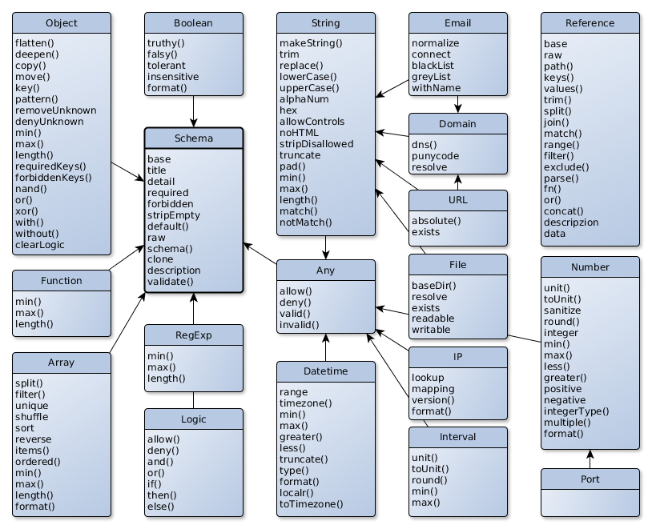

# Schema Builder

The schema defines how to validate and sanitize the data structures. It is defined
by using instances of the schema classes and setting their properties.

As far as possible the schema will be checked against validity while defining it. So generally
invalid setup like `new Number().min(6).max(3)` will directly throw an Error because it can neither
come to a valid state.

## Overview

All types are based on the `Schema` class directly or indirectly.

Each of this classes have different properties and settings which you can use to
specify it. They mostly inherit the parent methods but sometimes the use of specific parent methods
are disallowed.
Mostly the different validation settings you give are done in a predefined order, not always in the
order you define it.

See each class's description for more details.

One exception is the reference which is a special type not a subclass of Schema because it
didn't validate but will get the value from the defined resource. Read more about this later.

## Booleans

Where boolean values are required in the schema definition you can also use:
- 'yes', 1, '1', 'true', 't', '+', array or object
- 'no', 0, '0', 'false', 'f', '', '-', undefined, empty array or object

## References

This is a special value which may be used anywhere in the schema definition and points to a value.
It is a dynamic value which will only be known at validation time. If references are used the checking for correct schema definition can also not be completely done before validation. But it is also checked.
Read more about it at the end of this chapter with all the possibilities.

In the examples only simple references with direct values will be used. But all other work, too.
